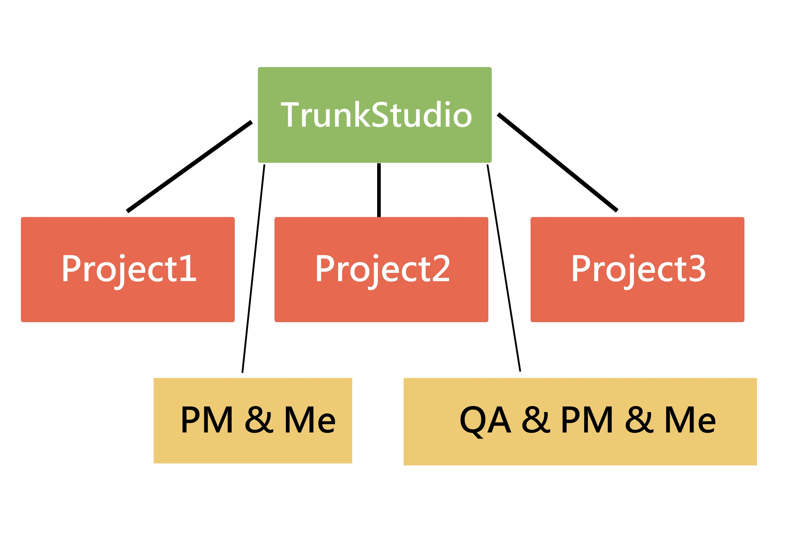
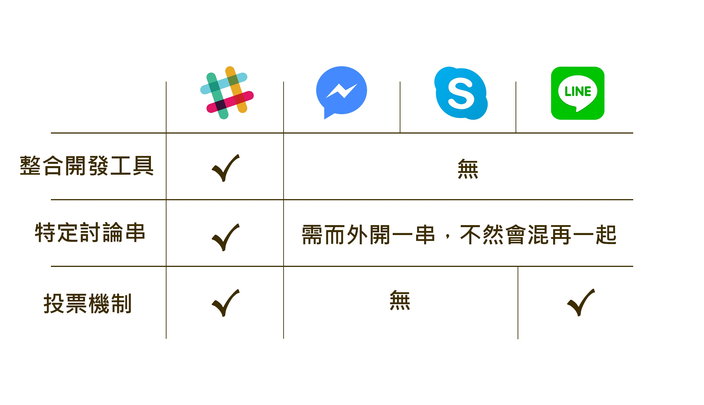
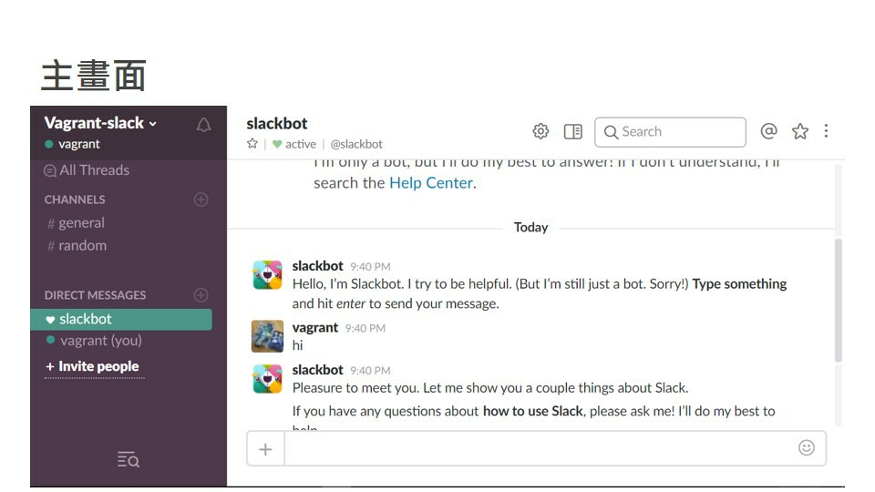
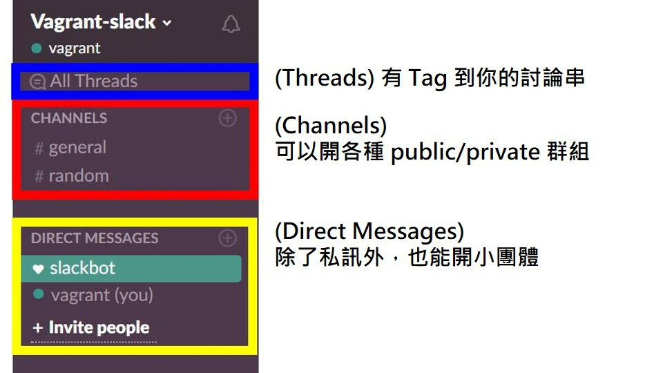
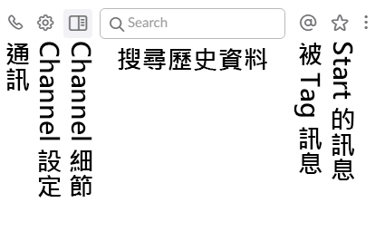

# HelloJS - Get Slack

## 課程簡報

[簡報傳送門](https://www.slideshare.net/trunk-studio/hellojs-get-slack)

## 優點在於

- 非常用軟體，能跟私人環境切割

- 輕鬆上手

- 輕鬆查閱歷史紀錄

- 輕鬆的分享檔案

- 超強擴展性

- 一堆小功能

- 階層式的架構

- 投票與個人狀態

## 所以為何 Slack 會適合團隊協作使用?

- Slack 是個團隊內部通訊平台(digital workspace)

- 每個 Channel 互不相擾(階層式)，所以無關自己專案的是部會吵到你

- 當你關閉 Notification 時，只有在有人標記你時才會跳出通知

- 所以歷史資訊都能被搜尋且分 Channel

- Thread 的使用能避免重要事情被其中的文字給插進來了

- 整合了很多開發上的工具

## 與其他通訊軟體的比較

## 畫面簡介

### 左邊功能

### 右邊功能

## Tips

- 要 Tag 某人時可以使用 @ + Slack ID

- 強制換行 Shift + Enter

- 方向鍵 上 可以快速修改最新的已發訊息

- Ctrl + k 可以快速傳送

## 其他學習資源

[Slack Guides](https://get.slack.help/hc/en-us/categories/202622877-Slack-Guides)

